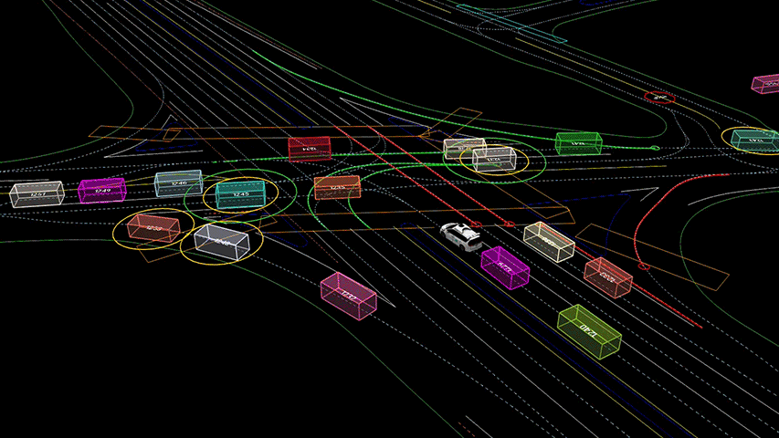
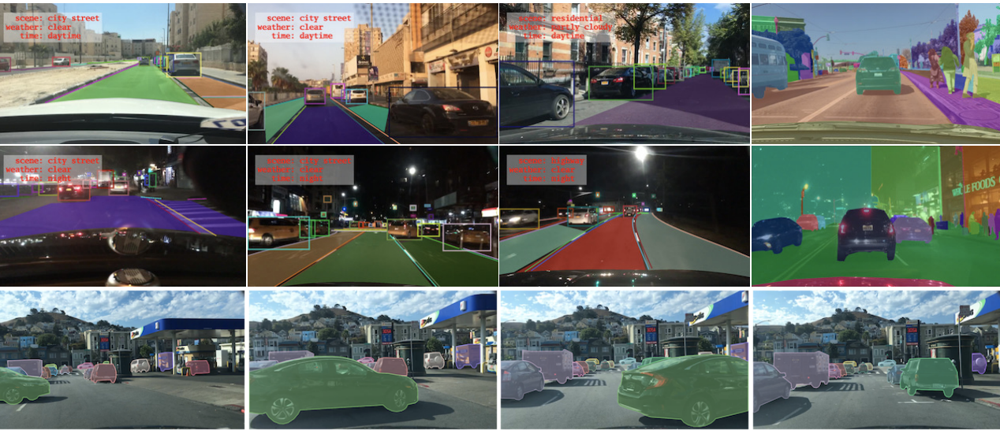
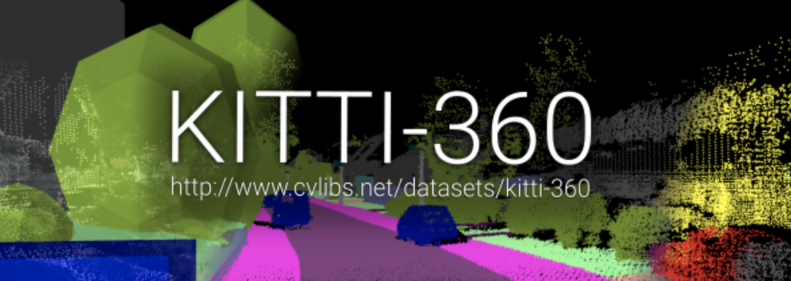
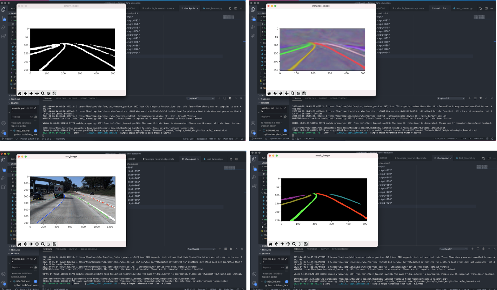
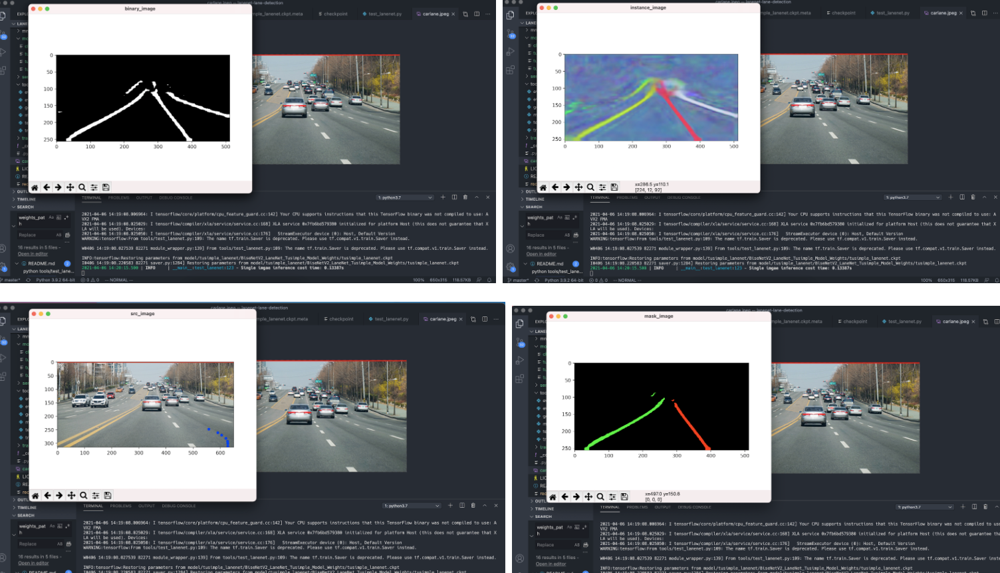

# self-driving-dataset

## [Waymo Open Dataset](https://waymo.com/open/)
Waymo는 2009년 Google 자율주행 프로젝트로  시작한 회사다. 회사의 목표는 누구나 안전하고 쉽게 목적지에 갈수 있게 하는것, 교통사고로 목숨을 잃는 수천명의 사람들을 지키는 것이다. Waymo는 연구 커뮤니티를 위해 크고 다양한 자율주행 데이터셋을 제공한다.

beb
## [Berkeley Deep Drive](https://bdd-data.berkeley.edu/)
Berkeley Deep Drive는 UC Berkeley에서 만든 데이터로 100,000개 이상의 HD 비디오 프레임과 이미지 레벨 태깅, 물체 바운딩 박스, 주행가능 지역 마킹, 차선 마킹, instance segmentation 어노테이션을 제공한다. 데이터셋은 다양한 지역의 환경과 날씨로 구성되어 있다.


## [KITTI](http://www.cvlibs.net/datasets/kitti/eval_object.php?obj_benchmark=3d)

KITTI (Karlsruhe Institute of Technology and Toyota Technological Institute)는 모바일 로봇틱스와 자율주행 자동차 필드에서 가장 유명한 데이터셋중 하나이다. 이 데이터셋은 고화질 RGB카메라, 세테레오 카메라, 3D 레이저 스캐너 데이터로 녹화된 데이터를 제공한다. Ground truth semantic segmentation 라벨은 제공하지 않는다. 하지만 여러 연구자 커뮤니티가 annotation을 제공하기도 한다.


## lanenet 실험
### 환경설정
- `cd lanenet-lane-detection`
- `pip install -r requirements.txt`

 ### 명령어
```python
python tools/test_lanenet.py --weights_path model/tusimple_lanenet/BiseNetV2_LaneNet_Tusimple_Model_Weights/tusimple_lanenet.ckpt-904 --image_path ./data/tusimple_test_image/0.jpg
```


```python
python tools/test_lanenet.py --weights_path model/tusimple_lanenet/BiseNetV2_LaneNet_Tusimple_Model_Weights/tusimple_lanenet.ckpt --image_path carlane.jpeg
```
